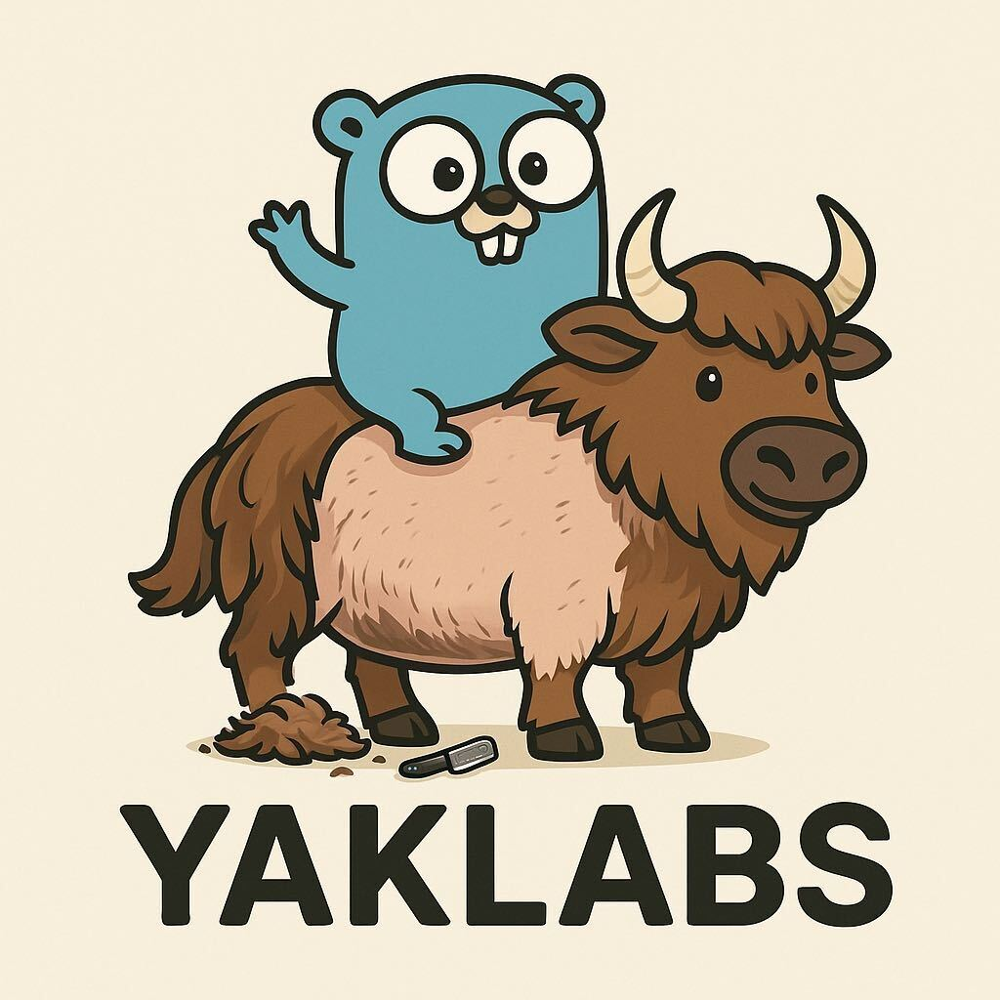

# Yaklab.org

<!-- markdownlint-disable no-inline-html -->

  

<!-- markdownlint-enable no-inline-html -->

We are inspired by great software and the possiblities it presents, both as an economic engine and as force for change. We founded Yaklab because we want to change our world and
spend our lives producing great software that does great things. Right now, we are unclear as to what this means. But for now it's a tight and deliberate collaboration and a represents a joining
of intellectual forces.

We have drafted a [manifesto](manifesto.md)which espouses our software development world view.

So far we have a single project [Stave](https://github.com/yaklabco/stave), which is based on the excellent work by [Nate Finch](https://github.com/natefinch).
